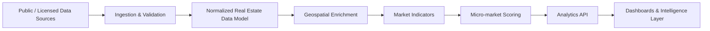

# Hyderabad Real Estate Intelligence Platform

A data and analytics platform for understanding how infrastructure growth, property pricing, RERA supply, and zoning/GIS signals interact across Hyderabad's real estate market.

The project is being built to help agencies, builders, and investors evaluate local market conditions, compare micro-markets, and identify areas with stronger long-term growth potential.

> **Status:** Active development. Core application code and datasets are maintained in a private repository.

## What I'm Building

The platform brings together multiple market signals that are usually analyzed separately:

- Property pricing and price movement
- RERA project supply and development activity
- Roads, metro, ORR/RRR and other infrastructure signals
- Zoning and GIS-based location context
- Project density and competitive supply
- Micro-market comparisons
- Growth scoring and trend analysis

The long-term goal is to move from static property comparisons toward a more structured **location intelligence and forecasting system**.

## Core Analysis Flow

## Platform Areas

### Market Intelligence
Compare locations using pricing, inventory, project activity, infrastructure access, and development signals.

### Infrastructure Intelligence
Track how major transport and civic infrastructure may influence surrounding real-estate activity.

### Supply Intelligence
Use RERA and project-level data to understand new supply, concentration, construction activity, and competitive pressure.

### Geospatial Analysis
Model proximity, accessibility, zoning context, project clusters, and infrastructure influence using GIS data.

### Forecasting
Develop data-driven indicators for identifying markets with stronger or weaker price-growth potential.

## Planned Technical Stack

**Data & Backend**
- Python
- FastAPI
- PostgreSQL
- PostGIS
- Pandas / GeoPandas
- SQLAlchemy

**Data Engineering**
- Scheduled ingestion pipelines
- Data validation and normalization
- Geospatial joins and enrichment
- Historical snapshots for trend analysis

**Analytics**
- Statistical feature engineering
- Comparable-market analysis
- Growth scoring
- Time-series and forecasting models

**Frontend**
- React / Next.js
- Interactive maps
- Market dashboards
- Property and locality comparison views

## Example Questions the Platform Should Answer

- Which Hyderabad micro-markets are seeing the strongest combination of infrastructure investment and price growth?
- Where is residential supply increasing faster than demand indicators?
- Which areas are benefiting from new road, metro, or employment-corridor connectivity?
- How does a project's pricing compare with nearby RERA supply?
- Which locations show improving fundamentals before that trend is fully reflected in asking prices?

## Repository Scope

This repository documents the public-facing architecture, analytical approach, and development roadmap.

The production code, data ingestion logic, source integrations, and working datasets are currently maintained privately while the platform is under development.

## Documentation

- [Architecture](docs/ARCHITECTURE.md)
- [Data Model](docs/DATA_MODEL.md)
- [Data Pipeline](docs/DATA_PIPELINE.md)
- [Roadmap](docs/ROADMAP.md)

## Current Focus

The current development phase is focused on:

1. Building a normalized Hyderabad real-estate data model
2. Structuring project and locality-level RERA data
3. Adding geospatial infrastructure context
4. Creating comparable-market and supply indicators
5. Establishing the foundation for growth scoring and forecasting
