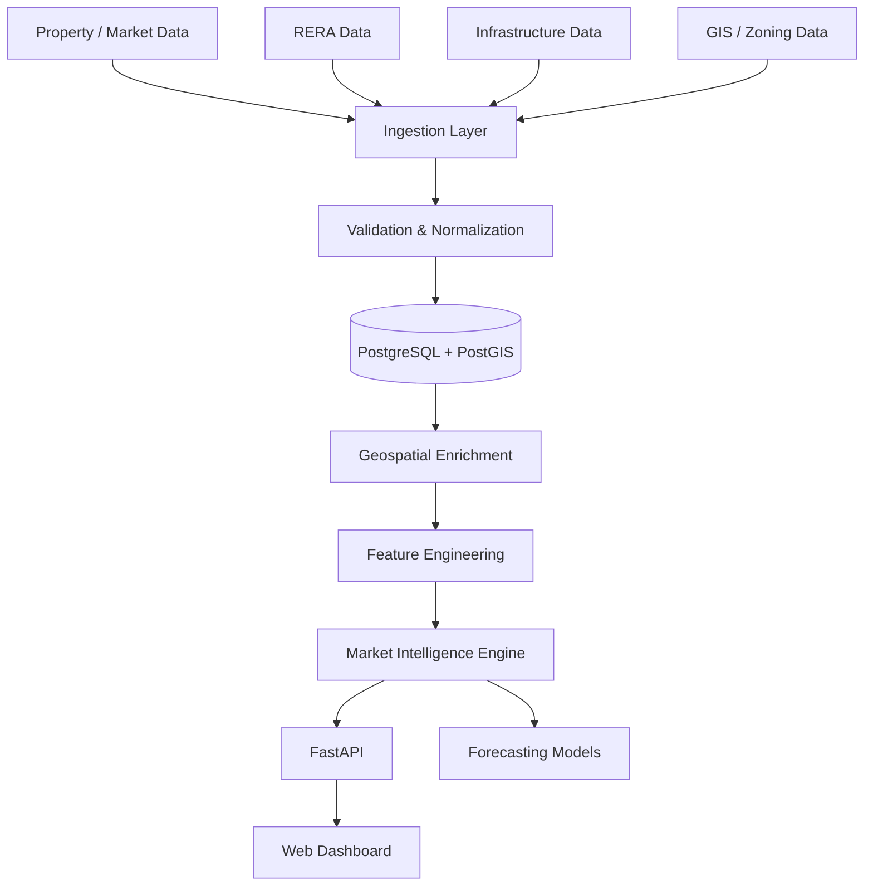

# Architecture

The platform is designed around a data-first architecture. Raw market and geospatial information is collected, normalized, enriched, and exposed through an analytics layer.

## Layers

### 1. Data ingestion

Responsible for collecting data from approved public, licensed, or manually curated sources.

Typical responsibilities:

- source adapters
- schema validation
- deduplication
- change detection
- historical snapshots

### 2. Core data model

PostgreSQL stores structured real-estate entities while PostGIS supports geospatial queries.

Core entities include:

- localities
- projects
- developers
- RERA registrations
- price observations
- infrastructure assets
- planning / zoning areas
- market snapshots

### 3. Geospatial enrichment

Location records are enriched with derived features such as:

- distance to major roads and transit
- infrastructure coverage
- nearby project density
- development clusters
- locality boundaries
- accessibility indicators

### 4. Intelligence layer

Transforms raw observations into decision-oriented indicators.

Examples:

- price momentum
- supply growth
- project concentration
- infrastructure exposure
- development intensity
- comparable-market positioning
- composite locality scores

### 5. API and presentation

FastAPI exposes normalized data and analytics to the frontend.

The application layer is intended to support:

- locality comparison
- project comparison
- map-based exploration
- infrastructure overlays
- time-series views
- ranked market opportunities

## Design Principles

- Keep raw data separate from derived analytics
- Preserve historical observations instead of overwriting them
- Make scoring explainable
- Treat geospatial context as a first-class part of the data model
- Avoid presenting forecasts without the underlying drivers
