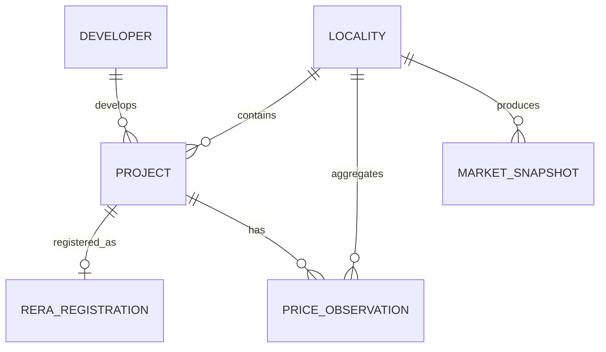

# Data Model

The data model is organized around **projects, localities, market observations, and geospatial context**.

## Core Entities

### Locality

Represents a Hyderabad neighborhood or micro-market.

Example fields:

```text
locality_id
name
zone
latitude
longitude
boundary_geometry
```

### Project

Represents a residential or commercial development.

```text
project_id
name
developer_id
locality_id
rera_id
project_type
launch_date
completion_date
latitude
longitude
```

### Developer

```text
developer_id
name
project_count
```

### RERA Registration

Stores structured regulatory and project-supply information.

```text
rera_id
project_id
registration_date
status
declared_completion_date
land_area
unit_count
```

### Price Observation

Historical pricing observations are stored separately rather than overwriting a project's current price.

```text
observation_id
project_id
locality_id
observation_date
price_per_sqft
source
```

### Infrastructure Asset

Represents major infrastructure that may influence accessibility or development.

```text
asset_id
name
asset_type
status
geometry
expected_completion_date
```

Examples:

- metro stations / corridors
- ORR / RRR connections
- major arterial roads
- employment corridors
- airports
- large civic infrastructure

### Market Snapshot

Stores periodically calculated market indicators.

```text
snapshot_id
locality_id
snapshot_date
median_price
price_growth
active_project_count
new_supply
infrastructure_score
market_score
```

## Relationships



## Analytical Features

Derived features can be calculated from the core entities without contaminating the raw source data.

Examples:

- 6 / 12 / 24 month price momentum
- new project supply
- RERA launch velocity
- developer concentration
- distance to infrastructure
- transit accessibility
- project density
- infrastructure completion exposure
- relative pricing versus nearby markets
