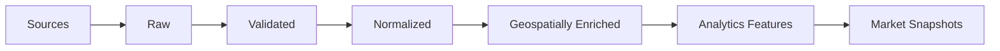

# Data Pipeline

The platform uses a staged pipeline so source data, cleaned data, and derived analytics remain separate.



## 1. Ingestion

Each source is handled through a dedicated adapter.

Typical output:

```text
source
source_record_id
ingested_at
raw_payload
```

This keeps source-specific logic outside the analytical model.

## 2. Validation

Records are checked for:

- required fields
- malformed prices or dates
- coordinate validity
- duplicate projects
- inconsistent RERA identifiers
- suspicious outliers

## 3. Normalization

Source-specific records are mapped into a common schema.

Examples:

```text
"Kondapur, Hyderabad"
"Kondapur"
"KONDAPUR"
```

should resolve to the same locality entity.

## 4. Geospatial Enrichment

PostGIS / GeoPandas can calculate features such as:

```text
distance_to_nearest_metro
distance_to_orr
projects_within_3km
new_supply_within_5km
employment_hubs_within_10km
```

## 5. Feature Engineering

Derived market indicators may include:

```text
price_momentum_12m
supply_growth_12m
infrastructure_exposure
development_density
relative_affordability
market_liquidity
```

## 6. Market Scoring

The first scoring system should remain transparent.

Example concept:

```text
Growth Score
= price momentum
+ infrastructure improvement
+ demand proxies
- excessive new supply
- pricing premium
```

Weights should be versioned and visible rather than hidden.

## 7. Historical Snapshots

Analytics are stored by date so the system can answer:

- what changed?
- when did the signal change?
- did the signal precede price movement?

This historical layer is also the foundation for future forecasting models.
